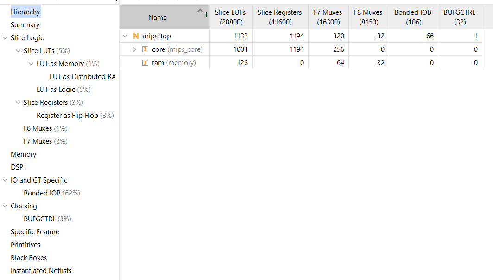
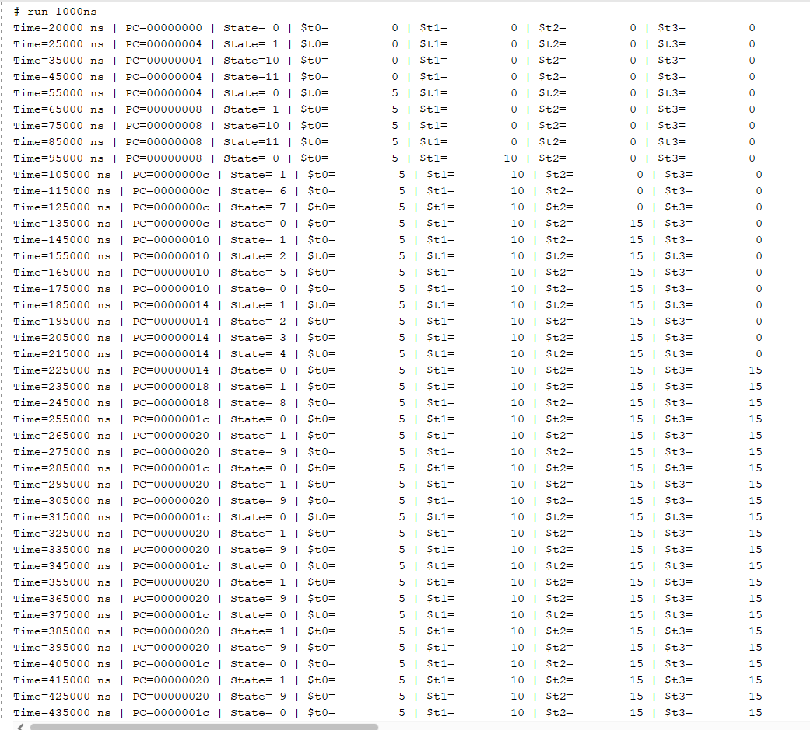
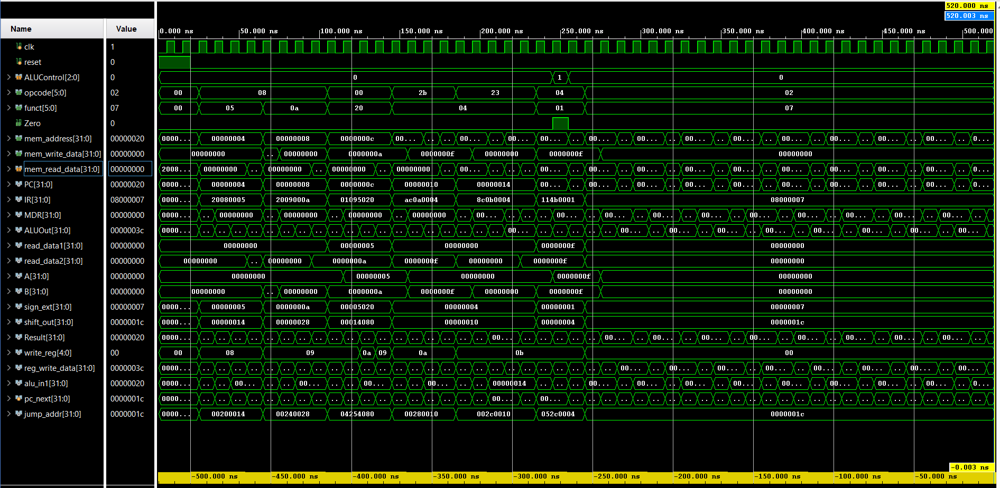

# 32-Bit Multi-Cycle MIPS Processor Core

A synthesizable 32-bit multicycle MIPS CPU core implemented in Verilog HDL, built around a shared ALU and a finite state machine (FSM) controller. The design fetches, decodes, and executes instructions over multiple clock cycles per instruction (as opposed to a single-cycle or pipelined design), reusing hardware such as the ALU and memory across cycles. Designed around a Von Neumann unified memory architecture, hardware time-multiplexing, and a 12-state Moore FSM control unit. Verified via Icarus Verilog simulation and synthesized on AMD/Xilinx Artix-7 FPGA (`xc7a35tcpg236-1`).

---

## Technical Specifications

| | |
|---|---|
| Architecture | Multi-cycle (3–5 clock cycles per instruction) |
| Data path width | 32-bit |
| Memory | Unified 256 × 32-bit RAM (instructions + data), word-aligned addressing (`addr[9:2]`) |
| Register file | 32 × 32-bit GPRs, `$0` hardwired to 0, async dual-port read, sync write |
| ALU operations | ADD, SUB, AND, OR, SLT |
| Control unit | 12-state Moore FSM |
| Target FPGA | AMD/Xilinx Artix-7 XC7A35T-1CPG236 |

---

## Features

- 32-bit datapath with a 32 × 32-bit register file (`$0`–`$31`, with `$0` hardwired to zero)
- Single shared ALU used for PC increment, branch target calculation, address calculation, and R-type operations
- FSM-based controller with 12 states covering fetch, decode, memory access, execution, and write-back
- Unified instruction/data memory (256 × 32-bit words)
- Supports core MIPS instructions:
  - **R-type:** `add`, `sub`, `and`, `or`, `slt`
  - **I-type:** `lw`, `sw`, `beq`, `addi`
  - **J-type:** `j`
- Fully synchronous reset
- Verified with waveform simulation (screenshot included)

---

## Architecture

The design follows the standard Patterson & Hennessy multicycle MIPS architecture, split into two main blocks:

- **Datapath** (`datapath`) — contains the PC, instruction register (IR), memory data register (MDR), A/B pipeline registers, ALU output register, register file, ALU, sign extender, and shift-left-2 unit.
- **Controller** (`controller_fsm`) — a Moore-style FSM that generates all control signals (`PCWrite`, `IRWrite`, `RegWrite`, `MemRead`, `MemWrite`, `ALUSrcA/B`, `PCSource`, `RegDst`, `MemtoReg`, `ALUControl`, `IorD`) based on the current state, opcode, and funct field.

```
 mips_top
┌───────────────────────────────────────────────────────────────┐
│                                                                 │
│   mips_core (core)                                             │
│  ┌───────────────────────────────────────────────────────┐    │
│  │                                                         │    │
│  │   controller_fsm (ctrl)                                 │    │
│  │   opcode, funct, Zero ──▶ [FSM] ──▶ control signals ────┼──┐ │
│  │                                                         │  │ │
│  └─────────────────────────────────────────────────────────┘  │ │
│                                                                 │ │
│  ┌───────────────────────────────────────────────────────┐    │ │
│  │   datapath (dp)                                        │◀───┘ │
│  │   PC, IR, MDR, A/B regs, ALUOut, register_file, alu,    │      │
│  │   sign_extend, shift_left_2                             │      │
│  │                                                         │      │
│  └───────────────────────────────────────────────────────┘      │
│         │ mem_address, mem_write_data      ▲ mem_read_data       │
│         ▼                                  │                     │
└─────────┼──────────────────────────────────┼─────────────────────┘
          │           MemRead, MemWrite      │
          ▼                                  │
      ┌───────────────────────────────────────────┐
      │   memory (ram)                             │
      │   256 x 32-bit unified instruction/data RAM │
      └───────────────────────────────────────────┘
```

`mips_core` wires the `datapath` and `controller_fsm` together internally. `mips_top` sits one level above and connects `mips_core` to the unified `memory` module via `mem_address`, `mem_write_data`, `mem_read_data`, `MemRead`, and `MemWrite` to form the complete system — matching the RTL schematic exported from synthesis.

---

## Module Hierarchy

```
mips_top.v
├── (Unified 256x32 RAM, instantiated inline)
└── mips_core.v
    ├── controller_fsm (12-State FSM, instantiated inline)
    └── datapath (instantiated inline)
        ├── register_file (32x32 Reg File)
        └── alu (32-Bit ALU)
```

| File Name | Description |
|---|---|
| `mips_top.v` | Top-level module — instantiates `mips_core` and the unified 256 × 32-bit memory, connecting them via `mem_address`, `mem_write_data`, `mem_read_data`, `MemRead`, `MemWrite`. |
| `mips_core.v` | CPU core — contains the 12-state `controller_fsm`, the datapath (PC, IR, MDR, A/B, ALUOut, MUXes, sign extension), the 32 × 32 register file, and the 32-bit ALU. |
| `tb_mips.v` | Testbench module pre-loaded with verification program. |

### CPU Schematics

- [MIPS_CPU_Schematic1.pdf](./MIPS_CPU_Schematic1.pdf) — Top-level / core interconnect schematic
- [MIPS_CPU_Schematic2.pdf](./MIPS_CPU_Schematic2.pdf) — Datapath / FSM detail schematic

---

## FSM States

| State | Description |
|---|---|
| `FETCH` | Read instruction from memory into IR, increment PC |
| `DECODE` | Decode opcode, precompute branch target |
| `MEM_ADDR` | Compute effective address (base + offset) for `lw`/`sw` |
| `MEM_READ` | Read data memory into MDR |
| `MEM_WB` | Write loaded data back to register file |
| `MEM_WRITE` | Write data memory |
| `EXECUTE` | Perform R-type ALU operation |
| `R_WB` | Write ALU result back to register file |
| `ADDI_EXEC` | Compute `addi` result |
| `ADDI_WB` | Write `addi` result back to register file |
| `BRANCH` | Compare registers, conditionally update PC |
| `JUMP` | Update PC with jump target |

---

## Supported Instruction Set (ISA)

| Instruction | Type | Opcode | Funct | Syntax | Operation |
|---|---|---|---|---|---|
| ADD | R | 0x00 | 0x20 | `add $rd, $rs, $rt` | `$rd = $rs + $rt` |
| SUB | R | 0x00 | 0x22 | `sub $rd, $rs, $rt` | `$rd = $rs - $rt` |
| AND | R | 0x00 | 0x24 | `and $rd, $rs, $rt` | `$rd = $rs & $rt` |
| OR | R | 0x00 | 0x25 | `or $rd, $rs, $rt` | `$rd = $rs \| $rt` |
| SLT | R | 0x00 | 0x2A | `slt $rd, $rs, $rt` | `$rd = ($rs < $rt) ? 1 : 0` |
| LW | I | 0x23 | — | `lw $rt, imm($rs)` | `$rt = Mem[$rs + SignExt(imm)]` |
| SW | I | 0x2B | — | `sw $rt, imm($rs)` | `Mem[$rs + SignExt(imm)] = $rt` |
| ADDI | I | 0x08 | — | `addi $rt, $rs, imm` | `$rt = $rs + SignExt(imm)` |
| BEQ | I | 0x04 | — | `beq $rs, $rt, offset` | `if ($rs == $rt) PC = BranchTarget` |
| J | J | 0x02 | — | `j target` | `PC = JumpTarget` |

---

## FSM State Sequence

```
                +------------+
                | 0: FETCH   |
                +-----+------+
                      |
                +-----v------+
                | 1: DECODE  |
                +-----+------+
                      |
    +-----------+-----------+-----------+-----------+-----------+
    | (lw/sw)   | (R-Type)  | (addi)    | (beq)     | (j)
+---v-----+ +---v------+ +--v-------+ +-v--------+ +v---------+
|2: ADDR  | |6: R_EXEC | |8: ADDI   | |10: BR    | |11: JMP   |
+---+-----+ +---+------+ +---+------+ +----------+ +----------+
    |           |             |
 +--+--+     +--v--+       +--v--+
 |     |     |7:WB |       |9:WB |
+v-+ +-v-+   +-----+       +-----+
|3:| |5: |
|R | |W  |
+--+ +-+-+
        |
      +-v---+
      |4:WB |
      +-----+
```

Equivalently, as a flow of state transitions by instruction type:

```
FETCH ──▶ DECODE ─┬─(R-type)──▶ EXECUTE ──▶ R_WB ─────┐
                   ├─(lw/sw)──▶ MEM_ADDR ─┬─(lw)──▶ MEM_READ ──▶ MEM_WB ─┐
                   │                      └─(sw)──▶ MEM_WRITE ──────────┤
                   ├─(addi)───▶ ADDI_EXEC ──▶ ADDI_WB ───────────────────┤
                   ├─(beq)────▶ BRANCH ─────────────────────────────────┤
                   └─(j)──────▶ JUMP ────────────────────────────────────┤
                                                                          ▼
                                                                       FETCH
```

---

## Repository Structure

```
.
├── mips_top.v                         # Top-level: unified memory + instantiates mips_core
├── mips_core.v                        # CPU core: controller FSM, datapath, register file, ALU
├── tb_mips.v                          # Testbench pre-loaded with verification program
├── GTK_wave.png                       # GTKWave simulation waveform screenshot
├── Report_utilization.png             # Vivado resource utilization report screenshot
├── Simulation_console_log.png         # Icarus Verilog simulation console output
├── MIPS_CPU_Schematic1.pdf            # Top-level RTL schematic
├── MIPS_CPU_Schematic2.pdf            # Datapath / FSM detail schematic
└── README.md
```

---

## Getting Started

### Prerequisites

Any standard Verilog simulator, e.g.:
- [Icarus Verilog](http://iverilog.icarus.com/) + [GTKWave](http://gtkwave.sourceforge.net/)
- Xilinx Vivado / ISE
- ModelSim / QuestaSim

### Simulate with Icarus Verilog

```bash
# 1. Compile design and testbench
iverilog -o mips_sim mips_top.v mips_core.v tb_mips.v

# 2. Execute simulation
vvp mips_sim

# 3. View waveforms in GTKWave
gtkwave mips_waveform.vcd
```

> Add your own `tb_mips.v` testbench that instantiates `mips_top`, drives `clk`/`reset`, and preloads the `mem` array in `memory` with test instructions.

### Synthesize with Vivado

1. Create a project targeting `xc7a35tcpg236-1`.
2. Add `mips_top.v`, `mips_core.v`, `controller_fsm.v`, `datapath.v`, `register_file.v`, `alu.v`, and `memory.v` as Design Sources.
3. Add `tb_mips.v` as Simulation Source.
4. Run **RTL Analysis → Elaborated Design** to inspect top-level ports and sub-modules.
5. Run **Synthesis** to generate resource utilization reports.

---

## Synthesis Results (Artix-7 XC7A35T)

- **Synthesis Tool:** AMD/Xilinx Vivado
- **Target Part:** `xc7a35tcpg236-1`

| Resource | Utilized | Available | Utilization % |
|---|---|---|---|
| Slice LUTs | 1,132 | 20,800 | 5.44% |
| Slice Registers (FFs) | 1,194 | 41,600 | 2.87% |
| F7 Multiplexers | 320 | 16,300 | 1.96% |
| F8 Multiplexers | 32 | 8,150 | 0.39% |
| IO Buffer Pins | 66 | 106 | 62.26% |
| Global Clock Buffers (BUFG) | 1 | 32 | 3.12% |



---

## RTL & Waveform Screenshots

### Simulation Console Log



### GTKWave Waveform Trace



The GTKWave capture above shows a sequence of instructions moving through the FSM states (`FETCH → DECODE → EXECUTE/MEM_ADDR → WB`), with `PC`, `IR`, `ALUOut`, `MDR`, and register file signals updating each cycle.

---

## Design Notes / Limitations

- Memory is a single unified 256-word array shared for instructions and data (no separate I-cache/D-cache).
- Only a subset of the MIPS ISA is implemented (`add`, `sub`, `and`, `or`, `slt`, `lw`, `sw`, `beq`, `addi`, `j`); other opcodes fall back to `FETCH`.
- No hazard handling is needed since this is a multicycle (not pipelined) design — each instruction completes before the next begins.
- No exception/interrupt handling.

## Future Improvements

- [ ] Add more instructions (`jal`, `jr`, `bne`, `addiu`, `andi`, `ori`, etc.)
- [ ] Add a testbench with a full instruction-level test program
- [ ] Parameterize memory size
- [ ] Add exception handling (overflow, invalid opcode)
- [ ] Convert to a pipelined 5-stage implementation for comparison
